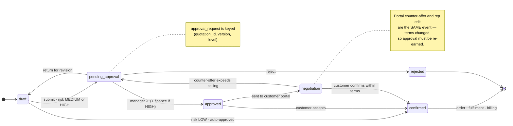
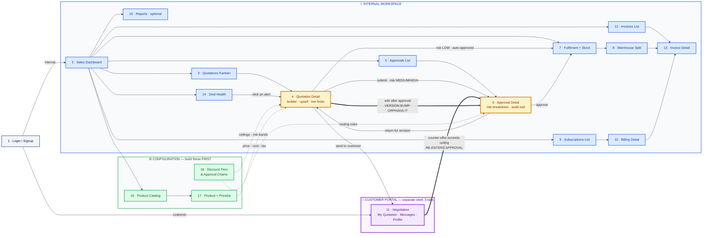

# DealFlow360 — Odoo Hackathon 2026 Finale

**Odoo India, Gandhinagar · 5–6 September 2026 · 24-hour on-site build · 4-person team**

A self-governing B2B sales-operations platform: multi-tier discount governance with automatic
approval routing, live upsell suggestions, multi-warehouse fulfilment splitting, hybrid one-time +
subscription billing, and a customer portal where the buyer negotiates the quotation directly.

> This repository is the **preparation and design workspace** — intel, problem-statement analysis,
> the schema, and the team playbooks. The application lives in its own repo.

---

## 🗺️ The Schema

**36 tables · 79 indexes · 43 CHECK constraints · 68 foreign keys — executed clean against PostgreSQL 17.11.**
All 18 mockup screens, with product variants, tier pricelists, multi-currency and proration history in
scope. Colour = domain. **Amber = the core**, where the governance logic lives.

```mermaid
flowchart TB

subgraph IDENT["🔐 IDENTITY & CUSTOMERS"]
    app_user["app_user<br/>role · portal⇄customer CHECK"]
    customer["customer"]
    customer_tier["customer_tier<br/>bronze 5 · silver 10 · gold 15"]
    sales_team["sales_team"]
    currency["currency"]
    fx_rate["fx_rate"]
end

subgraph CAT["📦 CATALOGUE"]
    product["product<br/>base_price + cost ⭐"]
    product_category["product_category<br/>hardware 15 · services 10"]
    product_variant["product_variant"]
    product_attribute["product_attribute"]
    attr_value["product_attribute_value"]
    variant_option["variant_option"]
    pricelist["pricelist"]
    pricelist_item["pricelist_item"]
end

subgraph GOV["⚖️ DISCOUNT GOVERNANCE"]
    approval_policy["approval_policy<br/>LOW · MEDIUM · HIGH bands"]
    approval_request["approval_request<br/>keyed on quotation_version"]
    audit_log["audit_log<br/>append-only"]
    deal_alert["deal_alert<br/>stalled · anomaly · slippage"]
end

subgraph QUO["📝 QUOTATION — the core"]
    quotation["quotation<br/>state · risk_score · VERSION"]
    quotation_line["quotation_line<br/>ceiling + cost snapshot<br/>generated money columns"]
    negotiation_request["negotiation_request"]
    negotiation_comment["negotiation_comment"]
    upsell_rule["upsell_rule"]
end

subgraph FUL["🚚 FULFILMENT"]
    warehouse["warehouse"]
    stock_level["stock_level<br/>on_hand − reserved = available"]
    sales_order["sales_order"]
    sales_order_line["sales_order_line"]
    fulfillment_allocation["fulfillment_allocation"]
    backorder["backorder"]
end

subgraph BIL["💳 BILLING & SUBSCRIPTIONS"]
    subscription_plan["subscription_plan"]
    subscription["subscription"]
    proration_event["proration_event<br/>immutable ledger"]
    invoice["invoice"]
    invoice_line["invoice_line"]
    payment["payment"]
    credit_note["credit_note"]
end

currency --> customer
customer_tier --> customer
sales_team --> app_user
customer --> app_user
customer --> quotation
app_user --> quotation
pricelist --> quotation
customer_tier --> pricelist
pricelist --> pricelist_item

product_category --> product
product --> product_variant
product --> product_attribute
product_attribute --> attr_value
attr_value --> variant_option
product_variant --> variant_option
product --> upsell_rule

quotation --> quotation_line
product --> quotation_line
quotation --> negotiation_request
negotiation_request --> negotiation_comment

quotation -->|version| approval_request
approval_policy -.->|routes| approval_request
quotation --> audit_log
quotation --> deal_alert

quotation --> sales_order
sales_order --> sales_order_line
quotation_line --> sales_order_line
sales_order_line --> fulfillment_allocation
warehouse --> fulfillment_allocation
warehouse --> stock_level
product --> stock_level
sales_order_line --> backorder

sales_order_line --> subscription
subscription_plan --> subscription
subscription --> proration_event
subscription --> invoice
sales_order --> invoice
invoice --> invoice_line
invoice --> payment
proration_event --> credit_note

classDef identity fill:#dbeafe,stroke:#2563eb,stroke-width:2px,color:#1e3a8a
classDef catalog  fill:#dcfce7,stroke:#16a34a,stroke-width:2px,color:#14532d
classDef govern   fill:#fee2e2,stroke:#dc2626,stroke-width:2px,color:#7f1d1d
classDef core     fill:#fef3c7,stroke:#d97706,stroke-width:3px,color:#78350f
classDef fulfil   fill:#e0e7ff,stroke:#4f46e5,stroke-width:2px,color:#312e81
classDef billing  fill:#f3e8ff,stroke:#9333ea,stroke-width:2px,color:#581c87

class app_user,customer,customer_tier,currency,fx_rate,sales_team identity
class product,product_category,product_variant,product_attribute,attr_value,variant_option,pricelist,pricelist_item catalog
class approval_policy,approval_request,audit_log,deal_alert govern
class quotation,quotation_line,negotiation_request,negotiation_comment,upsell_rule core
class warehouse,stock_level,sales_order,sales_order_line,fulfillment_allocation,backorder fulfil
class subscription_plan,subscription,proration_event,invoice,invoice_line,payment,credit_note billing

style IDENT fill:#f8fafc,stroke:#2563eb,stroke-width:2px,color:#1e3a8a
style CAT   fill:#f8fafc,stroke:#16a34a,stroke-width:2px,color:#14532d
style GOV   fill:#f8fafc,stroke:#dc2626,stroke-width:2px,color:#7f1d1d
style QUO   fill:#fffbeb,stroke:#d97706,stroke-width:3px,color:#78350f
style FUL   fill:#f8fafc,stroke:#4f46e5,stroke-width:2px,color:#312e81
style BIL   fill:#f8fafc,stroke:#9333ea,stroke-width:2px,color:#581c87
```



---

## 🔄 Quotation lifecycle

Five kanban stages from the mockup, plus the two exits. **Every edge that changes commercial terms
bumps `quotation.version` — which orphans any existing approval.**



---

## 🖥️ Screen wiring — all 18

From the mockup's own Navigation Key: *"Each module has one list screen (all records) and one detail
screen (one record, opened by clicking a row)."* Solid arrows = navigation. **Dashed = configuration
feeding the engine.** Red = the two self-governing loops.



> **Build order is not diagram order.** Screens 16–18 are numbered last but come **first** — screen 18
> is the input to every discount check in the app. Then `1 → 4 → 6 → 11 → 7/8 → 10 → 13`, which is the
> PS's own eight-step test flow.

---

## ⚖️ The two laws

Not conventions — **structural properties**. Postgres rejects violations, not a reviewer.

### LAW 1 — An approval belongs to a **version**, not to a quotation

`quotation.version` increments on any change to commercial terms. `approval_request` is keyed
`UNIQUE (quotation_id, quotation_version, level)`. A quotation is approved **iff** an `approved` row
exists for its *current* version.

> A rep gets 12% approved, then edits to 25%. With a boolean flag, the only defence is somebody
> remembering to reset it — and nobody remembers at hour 19. Keying to the version makes the edit
> **orphan its own approval**. There is no flag to forget.

**Never add an `is_approved` column.** It is a second source of truth that will drift from the first.

### LAW 2 — The database computes money. The application never does.

```sql
over_by_pct   GENERATED ALWAYS AS (GREATEST(0, discount_pct - ceiling_pct)) STORED
net_amount    GENERATED ALWAYS AS (ROUND(qty*unit_price*(1-discount_pct/100.0), 2)) STORED
margin_amount GENERATED ALWAYS AS (ROUND(qty*(unit_price*(1-discount_pct/100.0)-unit_cost),2)) STORED
qty_available GENERATED ALWAYS AS (qty_on_hand - qty_reserved) STORED
```

The app writes **inputs** — `qty`, `unit_price`, `unit_cost`, `discount_pct`, `ceiling_pct`.
It never writes **outputs**. Four screens computing one total is four chances to disagree, and the
one that disagrees will be the one on the projector.

`numeric` only. **Never `float`.**

---

## ✅ Coverage — every PS requirement has a home

Cross-checked line by line against the 13-page problem statement. **Four gaps were found on this pass
and closed** (marked 🆕).

| PS § | Requirement | Where it lives |
|---|---|---|
| A1 | Internal + portal login, one entry point | `app_user` · `portal_user_has_customer` CHECK |
| A2 | Product general info · variants · price lists | `product` · `product_attribute(_value)` · `product_variant` · `variant_option` · `pricelist(_item)` |
| A3 | Discount ceilings per tier | `customer_tier.max_discount_pct` |
| A3 | Category-specific ceilings | `product_category.max_discount_pct` |
| A3 | Blended score when categories mix | `effective_ceiling_pct()` → `LEAST()`, snapshot to `quotation_line.ceiling_pct` |
| A3 | Approval chain configuration | `approval_policy` (bands + thresholds, editable) |
| A3 | *"approvals, rejections and edits logged with user, timestamp and reason"* | `audit_log` · `approval_request.note` |
| A4 | Warehouses | `warehouse` |
| A4 | Stock levels | `stock_level` (+ `qty_available` generated) |
| A4 | 🆕 **Replenishment rules per warehouse** | `stock_level.reorder_point` · `.reorder_qty` |
| A4 | Shipping cost weighting for auto-split | `warehouse.shipping_cost_weight` · `fulfillment_allocation.shipping_cost` |
| A5 | Recurring plans (monthly/quarterly/yearly) | `subscription_plan.cycle` |
| A5 | Proration rules | `subscription_plan.proration_enabled` · `proration_event` |
| A5 | 🆕 **Cancellation + partial refund rules** | `subscription_plan.cancellation_notice_days` · `.cancellation_refund` |
| A6 | Product pairings | `upsell_rule` |
| A6 | Promoted products rank higher | `upsell_rule.is_promoted` · `.rank_score` · `.promo_text` |
| A6 | Minimum margin thresholds | `upsell_rule.min_margin_pct` (needs `product.cost`) |
| A7 | Export PDF / XLS | app layer — `jspdf` · `xlsx` |
| A7 | Filter: Period | `quotation.created_at` |
| A7 | 🆕 **Filter: Sales Team / Rep** | `sales_team` · `app_user.team_id` · `quotation.owner_user_id` |
| A7 | Filter: Approval Status | `approval_request.status` |
| A7 | Filter: Product / Category | `quotation_line.product_id` · `product.category_id` |
| B2 | Quotation kanban by stage | `quotation.state` (5 mockup columns + 3 exits) |
| B3 | Line discounts, live limit check | `quotation_line.ceiling_pct` · `over_by_pct` **generated** |
| B3 | Live margin indicator | `margin_amount` **generated** from `unit_cost` |
| B4 | Blended risk score + approval steps | `quotation.risk_score`/`risk_band` · `approval_request` |
| B4 | Full audit trail entry | `audit_log` |
| B6 | Warehouse split, manual override | `fulfillment_allocation` (+ `is_manual_override`) |
| B6 | Backorder + consolidate | `backorder.qty_outstanding` · `.resolved_at` |
| B7 | One-time and recurring on one order | `quotation_line.line_type` · `invoice.kind` |
| B7 | Mid-cycle proration | `proration_event` (immutable ledger) |
| B7 | Credit note on cancel/refund | `credit_note` · `proration_event.credit_note_id` |
| B8 | Portal: line comments, counter discount | `negotiation_request` · `negotiation_comment` |
| B8 | Requested delivery date | `negotiation_request.requested_delivery_date` |
| B8 | Re-enters approval past threshold | **`quotation.version` + `approval_request` key (Law 1)** |
| B9 | Stalled deals | `quotation.last_activity_at` · `deal_alert` |
| B9 | Discount anomaly vs rep average | `quotation.risk_score` grouped by `owner_user_id` |
| B9 | 🆕 **Delivery promise slippage** | `sales_order.promised_delivery_date` · `fulfillment_allocation.promised_ship_date` |
| B9 | 🆕 **Nudge / escalate from an alert** | `deal_alert.last_action` · `.last_action_at` · `.last_action_by_user_id` |
| §7 | Multi-currency *(bonus)* | `currency` · `fx_rate` · `currency_code` on every monetary root |

**Deliberately excluded:** multi-company (PS §7 calls it a bonus, and it would touch every table).

---

## 🧮 The blended discount risk score

Confirmed by the mockup's own words: *"Worst single line plus overall pattern across the order sets
the blended score."*

```sql
WITH l AS (
  SELECT over_by_pct, net_amount, SUM(net_amount) OVER () AS order_total
  FROM quotation_line WHERE quotation_id = $1
)
SELECT GREATEST(
         COALESCE(MAX(over_by_pct), 0),                                          -- worst line
         COALESCE(SUM(over_by_pct * net_amount) / NULLIF(MAX(order_total),0), 0) -- value-weighted
       )::numeric(6,2) AS risk_score
FROM l;
```

`LOW` → auto-approved · `MEDIUM` → sales manager · `HIGH` → sales manager **then** finance.
Thresholds are editable data, not constants.

The effective ceiling per line is `LEAST(tier.max_discount_pct, category.max_discount_pct)` — so a
**Gold** customer (15%) buying **Services** (10%) is capped at **10%**.

---

## 🛠️ Stack

| Layer | Choice | Why |
|---|---|---|
| Database | **PostgreSQL 17** | Generated columns, `FOR UPDATE`, partial indexes, `NULLS NOT DISTINCT` |
| Data access | **`pg` — no ORM** | Own the SQL where the hard parts are: reservation locking, risk scoring, report aggregation |
| Backend | **Node 22 · TypeScript · Express 5** | |
| Validation | **zod** (`z.strictObject()`) | Reject unknown keys at the boundary |
| Auth | **JWT + `bcryptjs`** | Pure JS — no node-gyp compile when the venue wifi dies |
| Frontend | **Vite · React · TypeScript** | |
| UI | **Tailwind v4 · shadcn/ui** | Consistency is a rubric MUST-HAVE |
| Data UI | **TanStack Query + Table** | 18 screens of lists, filters and pagination |
| Charts | **Recharts** | |
| Export | **jspdf · xlsx** | Screens 13 and 15 |

Every package verified present in a warm local npm cache — **the whole stack installs with the wifi
off.** `fastify`, `bcrypt` and `argon2` are *not* cached; don't reach for them.

---

## 📚 Repository index

| Document | What's in it |
|---|---|
| [prep/10-SCHEMA-AND-STACK.md](prep/10-SCHEMA-AND-STACK.md) | **Full DDL, indexes, the two laws, the schema-freeze rules** |
| [prep/09-DEALFLOW-ANALYSIS.md](prep/09-DEALFLOW-ANALYSIS.md) | All 18 screens decoded · risk-score design · build order |
| [prep/08-PS-DECISION.md](prep/08-PS-DECISION.md) | The three problem statements graded · what Odoo already ships |
| [prep/00-INTEL-BRIEFING.md](prep/00-INTEL-BRIEFING.md) | Rubric, judging mechanics, do's and don'ts |
| [prep/04-WAR-PLAN.md](prep/04-WAR-PLAN.md) | Hour-by-hour 24h timeline |
| [prompts/PROMPT-PACK.md](prompts/PROMPT-PACK.md) | 24 pre-written prompts (P0–P24) |
| [team/](team/) | Per-member briefs, git drill, environment setup |
| [RULES.md](RULES.md) | The hard rules |
| _(mockup + PS PDFs)_ | **Local only, not committed** — fully decoded as text in `prep/09` §8 |

---

## 🔒 Schema discipline

**One file. One owner. Frozen at T+3.**

After the freeze, changes are **additive only** — a new table, a new nullable column, a new index.
Never a rename, never a drop, never a type change. Every change is a new numbered migration; never
edit one someone else has already run. `db/reset.sh` restores a known-good seeded state in under ten
seconds, which is what makes the freeze survivable.

Full rules: [prep/10-SCHEMA-AND-STACK.md § Part D](prep/10-SCHEMA-AND-STACK.md).
